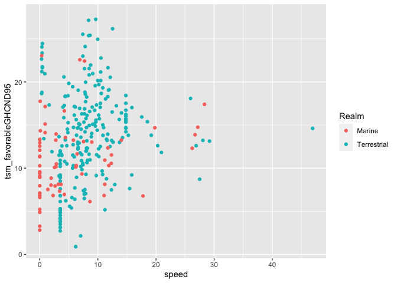

Shifts and traits
================

## Set up

``` r
require(here)
```

    ## Loading required package: here

    ## here() starts at /Users/mpinsky/Documents/Rutgers/Sax climate review/mar_terr_clim

``` r
require(data.table)
```

    ## Loading required package: data.table

``` r
require(ggplot2)
```

    ## Loading required package: ggplot2

``` r
tsm <- fread(here('data', 'pinsky_etal_2019', 'warmingtolerance_byspecies.csv'))
crawl <- fread('https://raw.githubusercontent.com/pinskylab/climate_community_crossrealm/master/data/crawling/Crawling_speeds.csv') # crawling speeds from the literature
```

## Add movement speed

``` r
#### Classify by movement mode
tsm[, mode := NA_character_]

# swimming
tsm[Class %in% c('Actinopterygii', 'Cephalaspidomorphi', 'Elasmobranchii', 'Holocephali', 'Cephalopoda'), mode := 'swimming'] # fishes
tsm[Class == 'Aves' & Order == 'Sphenisciformes', mode := 'swimming'] # penguins
tsm[Order %in% c('Cetacea', 'Sirenia') | Family %in% c('Odobenidae', 'Otariidae', 'Phocidae') | Genus %in% c('Enhydra'), mode := 'swimming'] # whales, manatees, seals, sea otter
tsm[Phylum %in% c('Rotifera', 'Chaetognatha', 'Ctenophora'), mode := 'swimming'] # rotifers, arrow worms, comb jellies
tsm[Class %in% c('Branchiopoda', 'Ostracoda', 'Scyphozoa', 'Appendicularia', 'Thaliacea'), mode := 'swimming'] # fairy shrimp, seed shrimp, true jellies, tunicates
tsm[Order %in% c('Calanoida', 'Cyclopoida', 'Harpacticoida', 'Siphonostomatoida'), mode := 'swimming'] # copepods
tsm[Order %in% c('Amphipoda', 'Euphausiacea', 'Mysida', 'Siphonophorae'), mode := 'swimming'] # amphipods, krill, mysid shrimp, siphonophores
tsm[Genus == 'Acartia', mode := 'swimming'] # certain copepods
tsm[Genus == 'Delphinidae', mode := 'swimming'] # dolphins
tsm[Genus == 'Sphyrna', mode := 'swimming'] # hammerhead sharks

# flying
tsm[Class == 'Aves' & Order != 'Sphenisciformes', mode := 'flying']
tsm[Class == 'Insecta' & !(Order %in% c('Plecoptera', 'Trichoptera')), mode := 'flying'] # except stoneflies and caddisflies
tsm[Genus %in% c('Cecidomyiidae'), mode := 'flying'] # gall midges
tsm[Realm == 'Terrestrial' & Class == 'Insecta' & Order %in% c('Plecoptera', 'Trichoptera'), mode := 'crawling'] # stoneflies and caddisflies

# running
tsm[Class %in% c('Reptilia', 'Amphibia') & !(Family %in% c('Colubridae', 'Elapidae', 'Natricidae', 'Pygopodidae', 'Typhlopidae')), mode := 'running'] # reptiles and amphibians run, except snakes/legless lizards
tsm[Class %in% c('Arachnida', 'Entognatha'), mode := 'running'] # spiders, Entognaths
tsm[Realm == 'Terrestrial' & Order %in% c('Isopoda'), mode := 'running'] # terrestrial isopods
tsm[Realm == 'Terrestrial' & Genus %in% c('Isopoda'), mode := 'running'] # terrestrial isopods
tsm[Genus %in% c('Acari', 'Cryptorhynchinae'), mode := 'running'] # mites & ticks, weevils
tsm[Realm == 'Freshwater' & Class == 'Insecta' & Order %in% c('Plecoptera', 'Trichoptera'), mode := 'running'] # stoneflies and caddisflies
tsm[Class %in% c('Merostomata', 'Pycnogonida'), mode := 'running'] # horseshoe crabs, sea spiders
tsm[Order %in% c('Cumacea', 'Decapoda', 'Stomatopoda'), mode := 'running'] # arthropods in mud/sand, crabs/lobsters, mantis shrimp
tsm[Realm == 'Marine' & Order %in% c('Isopoda'), mode := 'running'] # marine isopods
tsm[Realm == 'Marine' & Genus %in% c('Isopoda'), mode := 'running'] # marine isopods
tsm[Genus %in% c('Scoloplos'), mode := 'crawling'] # polychaetes

# crawling
tsm[Phylum %in% c( 'Annelida', 'Echinodermata', 'Sipuncula', 'Cephalorhyncha', 'Nemertea'), mode := 'crawling'] # segmented worms, echinoderms, sipunculid worms, ribbon worms
tsm[Class %in% c('Gastropoda'), mode := 'crawling'] # snails and slugs
tsm[Order == 'Squamata' & Family %in% c('Colubridae', 'Elapidae', 'Natricidae', 'Pygopodidae', 'Typhlopidae'), mode := 'crawling'] # snakes and legless lizards
tsm[Class %in% c('Polyplacophora', 'Priapulida'), mode := 'crawling'] # chitons, priapulid worms
tsm[Genus %in% c('Turbellaria', 'Valvata', 'Turbonilla', 'Odostomia', 'Epitonium'), mode := 'crawling'] # flatworms (some can swim...), snails
tsm[Genus %in% c('Turbonilla', 'Odostomia', 'Epitonium', 'Notomastus'), mode := 'crawling'] # sea snails, bristleworms

# stationary
tsm[Genus %in% c('Chaetoceros', 'Chlamydomonas', 'Diatom', 'Thalassiosira'), mode := 'stationary'] # diatoms, green algae
tsm[Phylum %in% c('Bryozoa', 'Porifera', 'Brachiopoda'), mode := 'stationary'] # bryozoans, sponges, brachiopods
tsm[Class %in% c('Bivalvia', 'Scaphopoda', 'Ascidiacea', 'Anthozoa'), mode := 'stationary'] # clams/oysters, tusk shells, ascidians, anemones/corals
tsm[Order %in% c('Sessilia', 'Anthoathecata', 'Leptothecata'), mode := 'stationary'] # barnacles, hydrozoans, 

#######
# calculate allometry for crawling
cmod <- crawl[, lm(log10(`max. speed [km/h]`) ~ log10(`body mass [kg]`))]
crawl_coef <- coef(cmod)
crawl_coef
```

    ##             (Intercept) log10(`body mass [kg]`) 
    ##               0.3569182               0.8367097

``` r
# calculate max speed (km/hr) from allometry
# Table S4 in Hirt et al. 2017 Nature E&E
tsm[, mass_kg := weight / 1000] # convert to kg from g
tsm[, speed := NA_real_]
tsm[mode == 'flying', speed := 142.8 * mass_kg^0.24 * (1 - exp(-2.4 * mass_kg^(-0.72)))]
tsm[mode == 'running', speed := 25.5 * mass_kg^0.26 * (1 - exp(-22 * mass_kg^(-0.6)))]
tsm[mode == 'crawling', speed := 10^(crawl_coef[1] + crawl_coef[2] * log10(mass_kg))]
tsm[mode == 'swimming', speed := 11.2 * mass_kg^0.36 * (1 - exp(-19.5 * mass_kg^(-0.56)))]
tsm[mode == 'stationary', speed := 0]
```

## Plot

``` r
ggplot(tsm, aes(speed, tsm_favorableGHCND95, color = Realm)) +
    geom_point()
```

    ## Warning: Removed 105 rows containing missing values (geom_point).

<!-- -->
